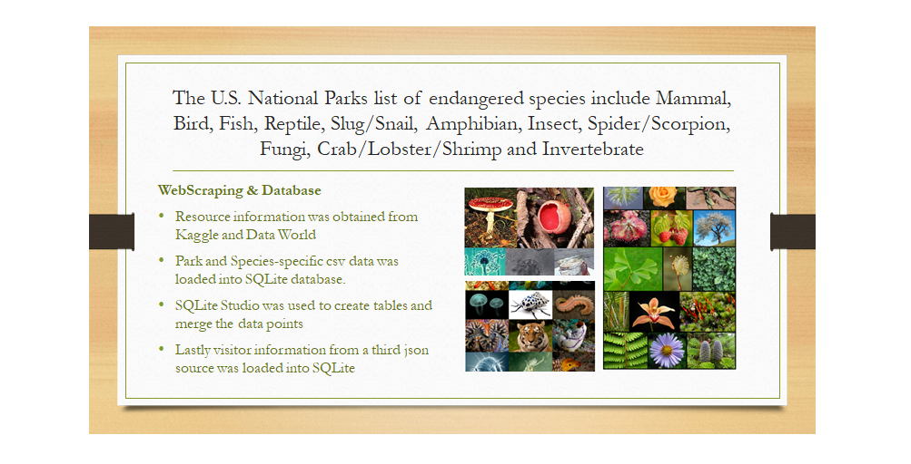
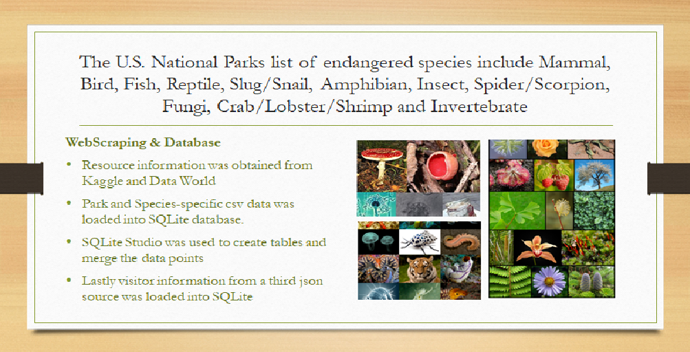

# Exploring the endangered species in the U.S National Park

* Interactive Leaflet map of the U.S. National Parks that includes the size, number of visitors and incorporates information on the species in the park that are endangered. We used JQuery JavaScript library to incorporate HTML and manipulation of data via the Flask API.

 
 # Heroku Link
 https://nps-bio.herokuapp.com/#
